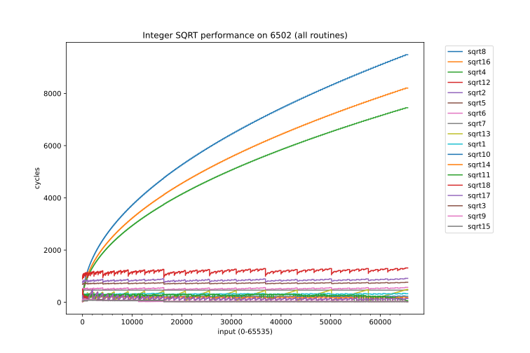

## 6502 Integer Square Root - which is best? ##

The purpose of this page is to compare the performance and memory cost of several different implementations of a 16 bit integer square root on the 6502 CPU, to find out which is best.
This function is sometimes known as isqrt, and conventionally it rounds down the result, so the result fits in 8 bits.

See the Wikipedia page for [integer square root](https://en.wikipedia.org/wiki/Integer_square_root) for details of algorithms.

We execute each routine exhaustively over all 65536 possible inputs, record the cycle count for each and graph the results.

### Implementations tested
All implementations have been sourced from the internet and reformatted for the acme assembler. See [here](https://github.com/TobyLobster/sqrt_test/tree/main/sqrt) for the actual files.

| file     | origin                                                           | notes                                          |
| -------- | ---------------------------------------------------------------- | ---------------------------------------------- |
| sqrt1.a  | https://codebase64.org/doku.php?id=base:fast_sqrt                |                                                |
| sqrt2.a  | http://www.6502.org/source/integers/root.htm                     |                                                |
| sqrt3.a  | http://www.txbobsc.com/aal/1986/aal8611.html#a1                  | a table based solution.                        |
| sqrt4.a  | http://www.txbobsc.com/aal/1985/aal8506.html#a2                  | adds successive odd numbers                    |
| sqrt5.a  | http://www.txbobsc.com/aal/1986/aal8609.html#a8                  |                                                |
| sqrt6.a  | https://www.bbcelite.com/master/main/subroutine/ll5.html         | from the BBC Micro game Elite.                 |
| sqrt7.a  | http://6502org.wikidot.com/software-math-sqrt                    |                                                |
| sqrt8.a  | https://mdfs.net/Info/Comp/6502/ProgTips/SqRoot                  | adds successive odd numbers                    |
| sqrt9.a  | https://github.com/TobyLobster/sqrt_test/blob/main/sqrt/sqrt9.a  | a table based solution, my version of sqrt3.a tweaked for performance. |
| sqrt10.a | https://github.com/TobyLobster/sqrt_test/blob/main/sqrt/sqrt10.a | my version of sqrt1.a tweaked for performance. |
| sqrt11.a | https://github.com/TobyLobster/sqrt_test/blob/main/sqrt/sqrt11.a | a table based solution, using binary search. from [here](http://forum.6502.org/viewtopic.php?p=90611#p90611) fixed and tweaked for performance. |
| sqrt12.a | https://gitlab.riscosopen.org/RiscOS/Sources/Apps/Diversions/Meteors/-/blob/master/Srce6502/MetSrc2#L961 | from the BBC Micro game Acornsoft Meteors |
| sqrt13.a | https://stardot.org.uk/forums/viewtopic.php?p=367937#p367937     | by hexwab                                      |
| sqrt14.a | https://stardot.org.uk/forums/viewtopic.php?p=367937#p367937     | by hexwab                                      |
| sqrt15.a | https://stardot.org.uk/forums/viewtopic.php?p=367937#p367937     | by hexwab                                      |
| sqrt16.a | https://github.com/TobyLobster/sqrt_test/blob/main/sqrt/sqrt16.a | adds successive odd numbers                    |
| sqrt17.a | https://github.com/TobyLobster/sqrt_test/blob/main/sqrt/sqrt17.a |                                                |
| sqrt18.a | https://github.com/TobyLobster/sqrt_test/blob/main/sqrt/sqrt18.a |                                                |

### Python Script
After assembling each file using [acme](https://github.com/meonwax/acme), we use [py65mon](https://github.com/mnaberez/py65/blob/master/docs/index.rst) to load and execute the binary 6502, check the results are accurate and record the cycle count.
The results are then output to a CSV file for graphing using a separate python program.

### Results

All algorithms provide the correct results. We graph the cycle count of each algorithm over all possible inputs.

We see immediately that three of the algorithms are much slower compared to the rest. sqrt4 and sqrt8 and sqrt16 each simply calculate squares by adding successive odd numbers. This turns out to be extremely slow for anything but small numbers. So we can get a more useful picture by omitting these three:

| file     | memory (bytes) | worst case cycles | average cycle count |
| -------- | -------------: | ----------------: | ------------------: |
| sqrt1.a  |             59 |               354 |               317.7 |
| sqrt2.a  |             73 |               923 |               846.5 |
| sqrt3.a  |            796 |               138 |                43.8 |
| sqrt4.a  |             36 |              7451 |              4989.1 |
| sqrt5.a  |             67 |               766 |               731.0 |
| sqrt6.a  |             55 |               574 |               522.9 |
| sqrt7.a  |             42 |               519 |               501.5 |
| sqrt8.a  |             37 |              9483 |              6342.4 |
| sqrt9.a  |            847 |               129 |                39.8 |
| sqrt10.a |            168 |               262 |               227.4 |
| sqrt11.a |            595 |               333 |               268.8 |
| sqrt12.a |             79 |              1315 |              1198.5 |
| sqrt13.a |            140 |               491 |               264.4 |
| sqrt14.a |            205 |               217 |               194.1 |
| sqrt15.a |            476 |               120 |                35.7 |
| sqrt16.a |             33 |              8205 |              5488.6 |
| sqrt17.a |            377 |               484 |               135.4 |
| sqrt18.a |            266 |              1044 |               146.0 |

All cycle counts include the final RTS, but not any initial JSR. Add 6 cycles for an initial 'JSR sqrt' instruction.

It is still crowded at the bottom of this graph. Here are the fastest, table based solutions:

### Conclusion

It's a speed vs memory trade off.
* If speed is all important and you can afford 476 bytes of memory then use the fastest routine sqrt15.a.
* If every byte counts, choose sqrt7.a (42 bytes).
* If every byte REALLY REALLY counts, choose sqrt16.a (33 bytes), but be aware that it's almost **eleven** times slower than sqrt7.a (42 bytes), and **twenty four** times slower than sqrt10.a.

The orange dots are good candidates to use. The grey dots are the also-rans, don't choose these because there are faster and smaller versions in orange.

Note however: sqrt9 and sqrt3 have two tables of squares (512 bytes). This memory cost can be shared with a fast multiply routine like https://everything2.com/user/eurorusty/writeups/Fast+6502+multiplication which uses the same tables.
